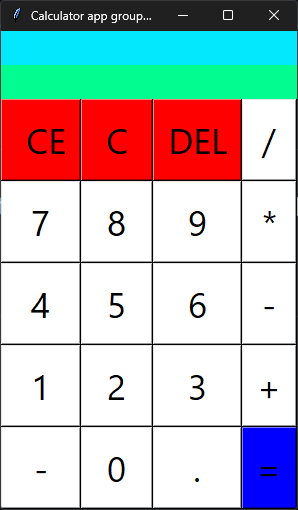

# calculator-app-tkinter
### A school group project to build a calculator using python and tkinter.

## How to run.
Execute the src/main.py file using Python.
or execute the min.py file (which is a single file).

## Dependencies.
Make sure to install tkinter before running this script.
Using pip: pip install tk
